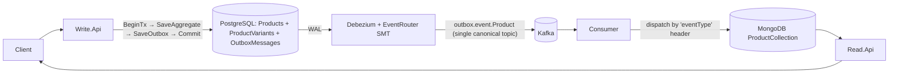

# CQRS Pattern with .NET

This repository demonstrates a practical implementation of the **CQRS (Command Query Responsibility Segregation)** pattern in .NET, combined with the **Transactional Outbox pattern**, **Debezium-based CDC**, **Kafka** message streaming, and **MongoDB** read-side projections.

The `Product` aggregate is modeled as a true DDD aggregate root with a `ProductVariant` child entity (each variant carries `Sku`, `Barcode`, `Color`, and `Size`). Domain events are translated into integration events and delivered through an **Outbox table** that Debezium captures with its [`EventRouter` SMT](https://debezium.io/documentation/reference/stable/transformations/outbox-event-router.html), so all business operations flow through a single canonical Kafka topic.

---

## Problem

Traditional CRUD-based systems often lead to:

* Complex and hard-to-maintain domain logic
* Performance bottlenecks under heavy read/write load
* Tight coupling between read and write operations
* "Dual-write" issues when persistence and message publishing happen in separate transactions

---

## Solution

This project applies **CQRS** to separate:

* **Commands (Write operations)** — modify state via a rich aggregate root with explicit business behaviors (`Create`, `Rename`, `AddVariant`, `RemoveVariant`).
* **Queries (Read operations)** — return denormalized data from MongoDB documents that include the full variants array.

And it applies the **Transactional Outbox pattern** so that aggregate state and integration events are written atomically in the same database transaction. Debezium then captures the outbox table and routes events to a single canonical Kafka topic via its `EventRouter` SMT.

---

## Architecture



### High-Level Flow

1. Client sends a command to the **Write API**.
2. MediatR dispatches the command to its handler, which loads/creates the `Product` aggregate.
3. Aggregate enforces invariants and emits domain events.
4. The repository commits a single DB transaction that writes both the aggregate state and the corresponding integration events to the `OutboxMessages` table.
5. Outbox rows are inserted and immediately deleted in the same transaction. Debezium still captures the inserts from the WAL while the table itself stays empty.
6. Debezium's `EventRouter` SMT publishes each event to the `outbox.event.Product` topic with `id` and `eventType` Kafka headers.
7. The **Consumer** reads the topic, deserializes the payload based on the `eventType` header, and applies it to the read-model projection via `IProductProjector`.
8. Idempotency is enforced by a `ProcessedEvents` Mongo collection keyed on the event's `id`.
9. The **Read API** queries the MongoDB document that now includes a denormalized `variants[]` array.

---

## Aggregate Behaviors

| Endpoint                                            | Command                  | Domain Method           | Integration Event       |
| --------------------------------------------------- | ------------------------ | ----------------------- | ----------------------- |
| `POST   /api`                                       | `Create`                 | `Product.Create`        | `ProductCreated`        |
| `PUT    /api/{id}/name`                             | `Rename`                 | `Product.Rename`        | `ProductRenamed`        |
| `POST   /api/{id}/variants`                         | `AddVariant`             | `Product.AddVariant`    | `ProductVariantAdded`   |
| `DELETE /api/{id}/variants/{variantId}`             | `RemoveVariant`          | `Product.RemoveVariant` | `ProductVariantRemoved` |

Variants carry `Sku`, `Barcode`, `Color`, and `Size`. Sku and Barcode are unique within a single product (enforced by both the aggregate invariants and PostgreSQL unique indexes).

---

## Debezium Connector Setup

The connector watches **only** the `outbox_messages` table (lowercase; Debezium/pgoutput does not reliably capture EF's quoted `"OutboxMessages"` identifier) and uses the official `EventRouter` SMT to extract the payload, route by `AggregateType`, and surface `id`/`eventType` as Kafka headers.

### Connector Endpoint

```
http://localhost:8083/connectors
```

### Connector Configuration

Use the checked-in connector definition at [`debezium/PostgresOutboxConnector.json`](debezium/PostgresOutboxConnector.json):

```bash
curl -X POST -H "Content-Type: application/json" \
  http://localhost:8083/connectors \
  -d @debezium/PostgresOutboxConnector.json
```

Important settings:

* `key.converter` / `value.converter` = `StringConverter` — payload must reach Kafka as plain JSON (not Connect envelope).
* `transforms.outbox.table.field.event.timestamp` = `OccurredAt` — column type must be `timestamp without time zone` (see `WriteDbContext`).
* `Id:header:id` in `additional.placement` — Consumer idempotency reads the event id from this header (falls back to payload `Id`).
* `snapshot.mode` = `never` — outbox table is always empty; initial snapshot would capture nothing useful.

---

## API Gateway

Swagger UI is available at:

```
https://localhost:7000/swagger/index.html
```

---

## Tech Stack

* .NET / ASP.NET Core
* MediatR
* FluentValidation
* Entity Framework Core (PostgreSQL)
* Debezium (CDC) + EventRouter SMT
* Confluent Kafka client
* MongoDB driver
* Docker

---

## How to Run

1. Start infrastructure with Docker Compose
2. Run the Write API, Read API, Gateway, and Consumer projects
3. Register the Debezium outbox connector against `http://localhost:8083/connectors`
4. Exercise the endpoints via Swagger or the Gateway

---

## Troubleshooting: Debezium RUNNING but no `outbox.event.Product` topic

**Most common cause:** EF Core creates the table as `"OutboxMessages"` (quoted, PascalCase). Debezium's `table.include.list` with `public."OutboxMessages"` often **never matches**, so WAL is read but **zero Kafka topics** are created. This repo uses `public.outbox_messages` (lowercase, unquoted) instead.

After fixing the table name, reset the pipeline:

```bash
# Postgres: drop old table + replication slot (see scripts/reset-debezium-pipeline.sql)
curl -X DELETE http://localhost:8083/connectors/PostgresOutboxConnector
curl -X POST -H "Content-Type: application/json" http://localhost:8083/connectors -d @debezium/PostgresOutboxConnector.json
```

Work through these checks in order:

1. **Kafka topic has messages** — open [Kafka UI](http://localhost:8090) → topic `outbox.event.Product`, or:
   ```bash
   docker exec -it broker kafka-console-consumer --bootstrap-server broker:29092 \
     --topic outbox.event.Product --from-beginning --max-messages 3 --property print.headers=true
   ```
   If the topic is missing or empty, the problem is **before** the Consumer (Write API outbox → Debezium → Kafka).

2. **Re-register the connector** with [`debezium/PostgresOutboxConnector.json`](debezium/PostgresOutboxConnector.json) (StringConverter + `Id:header:id`).

3. **Consumer bootstrap address** — inside Docker: `broker:29092` (set via `docker-compose.yml` env vars). Running Consumer from Visual Studio on the host: set `DOTNET_ENVIRONMENT=Development` so `appsettings.Development.json` uses `localhost:9092`. **Do not** load `appsettings.Development.json` inside Docker (it points to `localhost:9092`, which is wrong in a container). On startup the Consumer prints `Environment=`, `Kafka=`, and topic message counts.

4. **Trigger a write** after the connector is RUNNING, then watch Consumer logs for `Received outbox.event.Product[...]`.

---

## Notes

* Outbox rows are **inserted and deleted in the same transaction** (a Debezium-recommended pattern). The WAL still captures the inserts so events flow to Kafka, while the `OutboxMessages` table stays empty without a separate cleanup job.
* Idempotency is enforced per-event via a `ProcessedEvents` MongoDB collection.
* The Consumer uses Kafka's `EnableAutoCommit=false` and commits offsets only after a successful projection write.

---

## Future Improvements

* Optimistic concurrency / aggregate `Version` for write-side conflict detection
* Distributed tracing (OpenTelemetry) across Write API → Outbox → Debezium → Consumer → Read API
* Redis cache layer on the query side
* Integration tests with Testcontainers (Postgres, Kafka, Mongo)
* Schema registry (Avro/Protobuf) for the canonical event payloads

---

This repository is intended as a foundation for building scalable, event-driven systems with strong write-side consistency and rich read-side projections.
